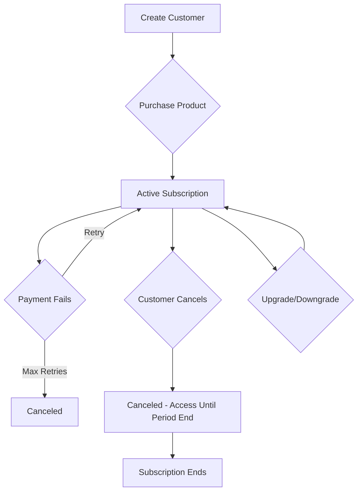

# Customers

Customers are the users or organizations that purchase your products in Autumn. The customer object stores identity, billing information, and tracks subscriptions.

## Customer Schema

From `source/shared/models/cusModels/cusModels.ts:5`, here's the customer structure:

```typescript
{
  // Identity
  id: string?,              // Your customer ID (e.g., "user_123")
  name: string?,            // Customer name
  email: string?,           // Customer email
  fingerprint: string?,     // Browser fingerprint (optional)
  
  // Metadata
  metadata: Record<string, any>?,  // Custom data
  
  // Billing
  processor: object?,       // Payment processor data (e.g., Stripe)
  processors: {             // Multi-processor support
    stripe?: { id: string },
    // ... other processors
  }?,
  send_email_receipts: boolean,
  
  // Internal
  internal_id: string,      // Autumn's internal ID
  org_id: string,           // Your organization ID
  env: "development" | "production",
  created_at: number
}
```

## Creating Customers

From `source/shared/models/cusModels/cusModels.ts:24`, customer creation has specific validation:

<Accordion title="Customer ID Validation">
  The `id` field must follow these rules:
  - Cannot be empty
  - Cannot contain `@` symbols
  - Cannot contain spaces
  - Cannot contain periods (`.`)
  - Only letters, numbers, underscores (`_`), and hyphens (`-`) allowed
  
  ```typescript
  // ✅ Valid IDs
  "user_123"
  "org-456"
  "customer789"
  
  // ❌ Invalid IDs
  "user@company.com"  // Contains @
  "user 123"          // Contains space
  "user.123"          // Contains period
  ```
  
  <Tip>
  Use your internal user/organization ID as the customer ID. This makes it easy to link Autumn customers to your database.
  </Tip>
</Accordion>

### Via API

```typescript
const { data } = await autumn.createCustomer({
  id: "user_123",
  name: "Alice Johnson",
  email: "alice@example.com",
  metadata: {
    signup_source: "landing_page",
    company: "Acme Corp"
  }
});
```

### Automatic Creation

Autumn automatically creates customers when you use `/attach` or `/track` with a new customer ID:

```typescript
// Customer is created automatically if it doesn't exist
await autumn.attach({
  customerId: "user_456",  // New customer
  productId: "pro-plan"
});
```

<Info>
Automatic customer creation is convenient, but creating customers explicitly gives you more control over name, email, and metadata.
</Info>

## Customer Metadata

Store custom data on customers using the `metadata` field:

```typescript
await autumn.createCustomer({
  id: "user_123",
  email: "alice@example.com",
  metadata: {
    // Company info
    company: "Acme Corp",
    company_size: "50-100",
    industry: "SaaS",
    
    // Tracking
    utm_source: "google",
    utm_campaign: "q1-2024",
    
    // Internal references
    crm_id: "contact_789",
    segment_id: "sg_abc123",
    
    // Preferences
    preferred_language: "en",
    timezone: "America/New_York"
  }
});
```

<Tip>
Metadata is perfect for storing references to your other systems (CRM IDs, analytics IDs, etc.) and customer preferences.
</Tip>

## Payment Processors

Autumn integrates with payment processors like Stripe:

```typescript
{
  processor: {
    type: "stripe",
    id: "cus_Abc123"  // Stripe customer ID
  },
  processors: {
    stripe: {
      id: "cus_Abc123"
    }
  }
}
```

<Note>
Autumn automatically creates Stripe customers when needed. You don't need to manage this manually.
</Note>

## Customer Products

When a customer purchases a product, Autumn creates a `customer_product` relationship:

```typescript
{
  internal_customer_id: string,
  internal_product_id: string,
  
  status: "active" | "canceled" | "trialing" | "paused",
  
  // Dates
  start_date: number,
  end_date: number?,
  cancel_at: number?,
  canceled_at: number?,
  trial_end: number?,
  
  // Billing
  current_period_start: number,
  current_period_end: number,
  
  // Custom pricing
  is_custom: boolean,
  
  // Processor data
  processor: {
    type: "stripe",
    subscription_id: "sub_123"
  }
}
```

### Customer Product Status

<Accordion title="active">
  Customer has active access to the product.
  - Billing is current
  - All features are accessible
  - Usage limits are enforced
</Accordion>

<Accordion title="trialing">
  Customer is in a free trial period.
  - No charges yet
  - Full access to features
  - Trial ends at `trial_end` timestamp
</Accordion>

<Accordion title="canceled">
  Subscription has been canceled.
  - Access continues until `end_date`
  - No renewal will occur
  - Customer can reactivate before end date
</Accordion>

<Accordion title="paused">
  Subscription is temporarily paused.
  - Access is disabled
  - Billing is paused
  - Can be resumed later
</Accordion>

## Customer Entitlements

Entitlements track feature access and usage for each customer. From `source/shared/models/cusProductModels/cusEntModels/cusEntModels.ts`:

```typescript
{
  internal_customer_id: string,
  internal_feature_id: string,
  internal_product_id: string,
  
  // Access
  allowance_type: "fixed" | "unlimited" | "none",
  allowance: number?,       // Total allowed per period
  
  // Usage tracking
  usage: number,            // Current usage this period
  
  // Reset schedule
  interval: "day" | "week" | "month" | "year"?,
  interval_count: number,
  reset_at: number?,        // Next reset timestamp
  
  // Rollover
  carried_over: number?,    // Amount rolled from previous period
  
  // Entity-based (seats, workspaces)
  entity_feature_id: string?,
  
  created_at: number,
  updated_at: number
}
```

<Info>
Customer entitlements are automatically created when attaching products. You rarely need to manage them directly.
</Info>

## Querying Customers

### Get Customer

```typescript
const { data } = await autumn.getCustomer({
  customerId: "user_123"
});

console.log(data.name);  // "Alice Johnson"
console.log(data.email); // "alice@example.com"
```

### List Customers

```typescript
const { data } = await autumn.listCustomers({
  limit: 100,
  offset: 0
});

console.log(data.customers); // Array of customers
console.log(data.total);     // Total count
```

### Get Customer with Products

```typescript
const { data } = await autumn.getCustomer({
  customerId: "user_123",
  expand: ["products", "entitlements"]
});

console.log(data.products);      // Active products
console.log(data.entitlements);  // Feature access
```

## Customer Lifecycle



### New Customer Flow

```typescript
// 1. Create customer
const { data: customer } = await autumn.createCustomer({
  id: "user_123",
  email: "alice@example.com"
});

// 2. Attach product (purchase)
const { data: attach } = await autumn.attach({
  customerId: "user_123",
  productId: "pro-plan"
});

// 3. Redirect to checkout
if (attach.url) {
  window.location.href = attach.url;
}

// 4. After successful payment, customer has access
const { data: check } = await autumn.check({
  customerId: "user_123",
  featureId: "api_calls"
});

if (check.allowed) {
  // Customer can use features
}
```

### Upgrade/Downgrade Flow

```typescript
// Customer currently on "starter" plan
// Upgrade to "pro" plan
const { data } = await autumn.attach({
  customerId: "user_123",
  productId: "pro-plan"
});

// Autumn handles:
// 1. Proration calculations
// 2. Updating Stripe subscription
// 3. Adjusting entitlements
// 4. Charging/crediting difference
```

<Tip>
Autumn automatically handles upgrade/downgrade logic, including proration and entitlement adjustments. You just call `attach()` with the new product ID.
</Tip>

### Cancellation Flow

```typescript
// Cancel subscription
const { data } = await autumn.cancel({
  customerId: "user_123",
  productId: "pro-plan"
});

console.log(data.end_date); // Access continues until this date

// Customer still has access
const { data: check } = await autumn.check({
  customerId: "user_123",
  productId: "pro-plan"
});

console.log(check.allowed); // true until end_date
```

## Real-world Patterns

### SaaS with Teams

```typescript
// Use team ID as customer ID
await autumn.createCustomer({
  id: `team_${teamId}`,  // e.g., "team_456"
  name: team.name,
  email: team.owner.email,
  metadata: {
    owner_id: team.ownerId,
    created_by: userId,
    member_count: team.members.length
  }
});

// All team operations use team ID
await autumn.attach({
  customerId: `team_${teamId}`,
  productId: "team-plan"
});

await autumn.check({
  customerId: `team_${teamId}`,
  featureId: "team_seats"
});
```

### User + Organization Model

```typescript
// Individual users
await autumn.createCustomer({
  id: `user_${userId}`,
  email: user.email,
  metadata: {
    user_id: userId
  }
});

// Organizations
await autumn.createCustomer({
  id: `org_${orgId}`,
  name: org.name,
  metadata: {
    org_id: orgId,
    owner_id: org.ownerId
  }
});

// Determine which to use based on context
const customerId = context === "personal" 
  ? `user_${userId}` 
  : `org_${orgId}`;

await autumn.check({ customerId, featureId: "api_calls" });
```

### Anonymous to Authenticated

```typescript
// Start with fingerprint
await autumn.track({
  customerId: fingerprint,  // Browser fingerprint
  featureId: "api_calls",
  value: 1
});

// After signup, link to user
await autumn.updateCustomer({
  customerId: fingerprint,
  id: `user_${userId}`,  // Update to user ID
  email: user.email,
  name: user.name
});

// Usage is preserved under new ID
```

### Multi-tenant Billing

```typescript
// Each tenant is a customer
for (const tenant of tenants) {
  await autumn.createCustomer({
    id: `tenant_${tenant.id}`,
    name: tenant.name,
    metadata: {
      tenant_id: tenant.id,
      plan_type: tenant.planType,
      created_at: tenant.createdAt
    }
  });
}

// Usage tracking per tenant
async function handleApiRequest(req) {
  const tenantId = req.tenant.id;
  
  await autumn.track({
    customerId: `tenant_${tenantId}`,
    featureId: "api_calls",
    value: 1
  });
}
```

## Email Receipts

Control whether Autumn sends payment receipts:

```typescript
await autumn.createCustomer({
  id: "user_123",
  email: "alice@example.com",
  send_email_receipts: true  // Enable email receipts
});
```

<Note>
Email receipts require your Autumn organization to have email configured. Receipts are sent for successful payments and refunds.
</Note>

## Environment Isolation

Customers are scoped to environments:

```typescript
// Development customer
{
  id: "user_123",
  env: "development",
  // ... test data
}

// Production customer (separate)
{
  id: "user_123",
  env: "production",
  // ... real data
}
```

<Tip>
Development and production customers are completely isolated. You can use the same IDs in both environments without conflicts.
</Tip>

## Best Practices

<Tip>
**Use your own IDs**: Set customer `id` to your internal user/org ID. This makes it easy to link Autumn data to your database.
</Tip>

<Tip>
**Store metadata**: Use the `metadata` field to store references to your other systems (CRM, analytics, etc.).
</Tip>

<Tip>
**Email for receipts**: Always provide an email address if you want customers to receive payment receipts.
</Tip>

<Note>
**Create explicitly when possible**: While automatic customer creation is convenient, explicitly creating customers gives you control over name, email, and metadata.
</Note>

<Tip>
**Consistent prefixes**: Use consistent ID prefixes (`user_`, `org_`, `team_`) to make debugging easier.
</Tip>

## Next Steps

<CardGroup cols={2}>
  <Card title="Entities" icon="users" href="/concepts/entities">
    Learn about seat-based pricing with entities
  </Card>
  <Card title="Attach API" icon="link" href="/api/attach">
    Attach products to customers
  </Card>
  <Card title="Customers API" icon="code" href="/api/customers/create">
    Create and manage customers
  </Card>
  <Card title="Check API" icon="check" href="/api/check">
    Check customer feature access
  </Card>
</CardGroup>