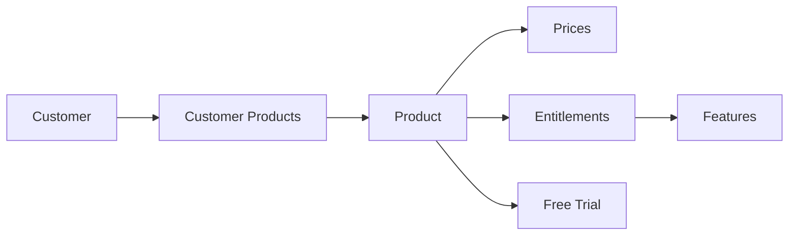

# Products

Products are the foundation of your pricing model in Autumn. A product represents a specific offering you're selling to customers, such as a subscription plan, add-on, or standalone service.

## What is a Product?

In Autumn, a product is a container that bundles together:
- **Pricing configuration** - How much and how often customers are charged
- **Features** - What capabilities customers get access to
- **Entitlements** - Usage limits and access rules for each feature

<Info>
Think of a product as a "package" that customers can purchase. For example, a "Pro Plan" product might include API access (feature) with 10,000 requests per month (entitlement) for $49/month (price).
</Info>

## Product Schema

Based on the Autumn codebase at `source/shared/models/productModels/productModels.ts:8`, here's the core product structure:

```typescript
{
  id: string,              // Unique identifier (e.g., "pro-plan")
  name: string,            // Display name (e.g., "Pro Plan")
  description: string?,    // Optional description
  is_add_on: boolean,      // Whether this is an add-on product
  is_default: boolean,     // Whether this is the default product
  version: number,         // Product version for migrations
  group: string,           // Group products together (e.g., "tier")
  
  // Internal fields
  internal_id: string,
  org_id: string,
  env: "development" | "production",
  created_at: number,
  archived: boolean,
  
  // Stripe integration
  processor: {
    type: string,
    id: string
  }?
}
```

## Product Types

Autumn supports two main product types:

<Accordion title="Base Products">
  Base products are standalone offerings that customers can subscribe to. They typically include:
  - A recurring price (subscription)
  - A set of features with usage limits
  - Optional free trial configuration
  
  **Example**: A "Starter" plan with basic features for $19/month
</Accordion>

<Accordion title="Add-on Products">
  Add-on products extend existing subscriptions. Set `is_add_on: true` to mark a product as an add-on.
  
  Add-ons are useful for:
  - Additional feature access
  - Extra usage capacity
  - Optional capabilities
  
  **Example**: A "Priority Support" add-on for $29/month that can be added to any plan
</Accordion>

## Full Product Structure

A complete product includes prices, entitlements, and features. From `source/shared/models/productModels/productModels.ts:53`:

```typescript
{
  // Basic product fields
  ...product,
  
  // Pricing
  prices: Price[],
  
  // Features & access
  entitlements: {
    id: string,
    feature: Feature,
    allowance_type: "fixed" | "unlimited" | "none",
    allowance: number?,
    interval: "month" | "year" | "week" | "day"?,
    interval_count: number
  }[],
  
  // Free trial
  free_trial: {
    duration: number,
    unit: string
  }?
}
```

## Pricing Configuration

Products can have multiple pricing configurations:

### Recurring Subscription

```json
{
  "id": "pro-plan",
  "name": "Pro Plan",
  "prices": [
    {
      "config": {
        "type": "fixed",
        "amount": 4900,  // $49.00 in cents
        "interval": "month",
        "interval_count": 1
      }
    }
  ]
}
```

### One-time Payment

```json
{
  "id": "lifetime-access",
  "name": "Lifetime Access",
  "prices": [
    {
      "config": {
        "type": "fixed",
        "amount": 29900,  // $299.00
        "interval": "once"
      }
    }
  ]
}
```

### Usage-based Pricing

```json
{
  "id": "pay-as-you-go",
  "name": "Pay As You Go",
  "prices": [
    {
      "config": {
        "type": "usage",
        "feature_id": "api_calls",
        "billing_units": 1000,  // Bill per 1000 calls
        "usage_tiers": [
          { "to": 10000, "amount": 1000 },    // $10 per 1k
          { "to": 100000, "amount": 800 },    // $8 per 1k
          { "to": "infinite", "amount": 600 } // $6 per 1k
        ],
        "interval": "month"
      }
    }
  ]
}
```

<Tip>
You can combine multiple price configurations in a single product. For example, a base subscription price plus usage-based charges for overages.
</Tip>

## Product Groups

Use the `group` field to organize related products:

```typescript
// Tiered pricing
{ id: "starter", name: "Starter", group: "tier" }
{ id: "pro", name: "Pro", group: "tier" }
{ id: "enterprise", name: "Enterprise", group: "tier" }

// Add-ons
{ id: "priority-support", name: "Priority Support", group: "add-ons", is_add_on: true }
{ id: "white-label", name: "White Label", group: "add-ons", is_add_on: true }
```

## Product Versioning

Autumn supports product versioning for migrations and updates. The `version` field tracks product schema versions:

<Note>
When you update a product's structure, increment the version number. Autumn handles migrations automatically for existing customers.
</Note>

## Relationships



### Product → Plans

In the API, products are often referred to as "plans." These terms are used interchangeably:
- **Product**: The backend model (database representation)
- **Plan**: The API representation (what developers interact with)

See the [Plans](/concepts/plans) page for the API perspective.

### Product → Features

Products grant access to features through entitlements. Each entitlement specifies:
- Which feature is included
- How much usage is allowed
- When usage resets

Learn more on the [Features](/concepts/features) page.

### Product → Customers

When a customer purchases a product, Autumn creates a `customer_product` relationship that tracks:
- Active/canceled status
- Start and end dates
- Custom pricing overrides
- Usage and billing history

See [Customers](/concepts/customers) for details.

## Environment Management

Every product belongs to an environment:

<Accordion title="Development Environment">
  Use `env: "development"` for testing and development. Development products:
  - Don't charge real money
  - Can be freely modified
  - Don't appear in production
</Accordion>

<Accordion title="Production Environment">
  Use `env: "production"` for live products. Production products:
  - Charge real money via Stripe
  - Should be carefully versioned
  - Are visible to all customers
</Accordion>

## Common Patterns

### SaaS Tiered Pricing

```typescript
// Starter tier
{
  id: "starter",
  name: "Starter",
  group: "tier",
  prices: [{ amount: 1900, interval: "month" }],
  entitlements: [
    { feature: "projects", allowance: 3 },
    { feature: "team_members", allowance: 1 },
    { feature: "storage_gb", allowance: 10 }
  ]
}

// Pro tier
{
  id: "pro",
  name: "Pro",
  group: "tier",
  prices: [{ amount: 4900, interval: "month" }],
  entitlements: [
    { feature: "projects", allowance_type: "unlimited" },
    { feature: "team_members", allowance: 10 },
    { feature: "storage_gb", allowance: 100 }
  ]
}
```

### Usage-based with Base Fee

```typescript
{
  id: "usage-plan",
  name: "Usage-based Plan",
  prices: [
    // Base subscription
    {
      config: {
        type: "fixed",
        amount: 2900,
        interval: "month"
      }
    },
    // Usage charges
    {
      config: {
        type: "usage",
        feature_id: "api_calls",
        billing_units: 1000,
        usage_tiers: [
          { to: "infinite", amount: 500 } // $5 per 1k calls
        ],
        interval: "month"
      }
    }
  ]
}
```

### Add-on Product

```typescript
{
  id: "extra-seats",
  name: "Additional Team Seats",
  is_add_on: true,
  prices: [
    {
      config: {
        type: "fixed",
        amount: 1500,  // $15 per seat
        interval: "month"
      }
    }
  ],
  entitlements: [
    {
      feature: "team_members",
      allowance: 5,  // 5 additional seats
      entity_feature_id: "team_members"  // Track per-seat usage
    }
  ]
}
```

## Next Steps

<CardGroup cols={2}>
  <Card title="Plans" icon="layer-group" href="/concepts/plans">
    Learn about the API representation of products
  </Card>
  <Card title="Features" icon="puzzle-piece" href="/concepts/features">
    Understand feature types and configurations
  </Card>
  <Card title="Pricing Models" icon="dollar-sign" href="/concepts/pricing-models">
    Explore the 4 main pricing models
  </Card>
  <Card title="Create Product API" icon="code" href="/api/products/create">
    Create products via the API
  </Card>
</CardGroup>