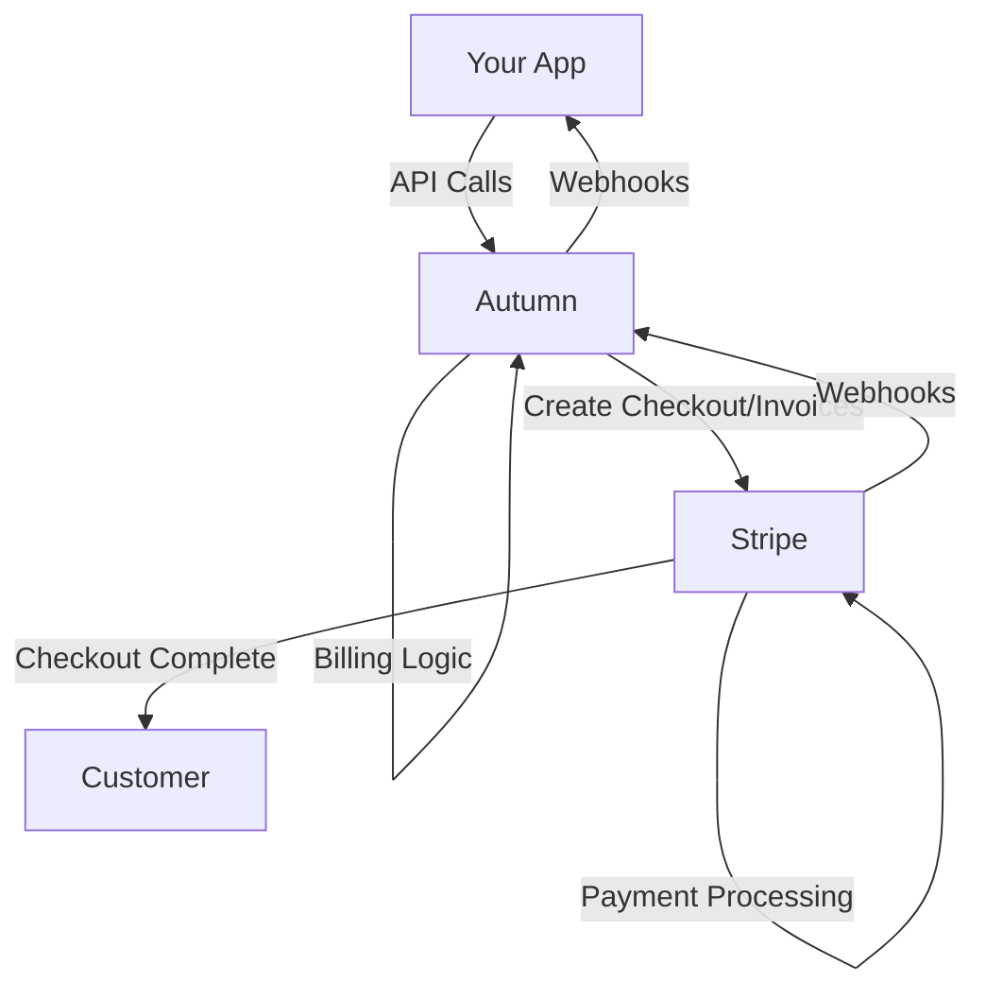

## Overview

Autumn integrates deeply with Stripe to handle:

- Payment collection via Stripe Checkout
- Subscription management and billing cycles
- Usage-based invoicing with metered billing
- Automatic proration calculations
- Webhook synchronization between Stripe and Autumn

<Tip>
Autumn handles the complexity of Stripe's API so you don't have to. All billing logic is managed by Autumn, with Stripe handling payment processing.
</Tip>

## How Autumn Uses Stripe

### Architecture Overview



### Key Concepts

**Autumn manages:**
- Product configuration and features
- Usage tracking and balance calculations
- Subscription lifecycle logic
- Proration calculations
- Feature access control

**Stripe manages:**
- Payment collection
- Credit card processing
- Invoice generation
- Subscription billing cycles
- Payment retries and dunning

## Setting Up Stripe

<Steps>
  <Step title="Connect Stripe account">
    Link your Stripe account in the Autumn dashboard.

    1. Go to Autumn Dashboard → Settings → Integrations
    2. Click "Connect Stripe"
    3. Authorize Autumn to access your Stripe account
  </Step>

  <Step title="Configure webhook endpoint">
    Autumn needs to receive webhooks from Stripe.

    The webhook endpoint is automatically configured during Stripe connection:
    ```
    https://api.autumn.com/webhooks/stripe
    ```
  </Step>

  <Step title="Set up Stripe products (optional)">
    Autumn can create Stripe products automatically, or you can create them manually.

    **Automatic (recommended):**
    ```typescript
    // Autumn creates Stripe products when you create products
    const product = await autumn.products.create({
      id: "pro-monthly",
      name: "Pro Plan",
      price: 3000,  // $30.00 in cents
      interval: "month"
    });
    // Stripe product and price are created automatically
    ```

    **Manual:**
    Create products in Stripe Dashboard and reference them in Autumn:
    ```typescript
    const product = {
      id: "pro-monthly",
      stripe_product_id: "prod_abc123",
      stripe_price_id: "price_xyz789"
    };
    ```
  </Step>

  <Step title="Configure checkout settings">
    Customize Stripe Checkout appearance and behavior.

    ```typescript
    await autumn.settings.update({
      stripe: {
        checkout: {
          brand_color: "#5469d4",
          logo_url: "https://example.com/logo.png",
          payment_method_types: ["card"],
          allow_promotion_codes: true
        }
      }
    });
    ```
  </Step>
</Steps>

## Payment Collection Flows

### Stripe Checkout (Default)

Redirect customers to Stripe-hosted payment page:

```typescript
const response = await autumn.attach({
  customer_id: "customer_123",
  plan_id: "pro-monthly",
  redirect_mode: "if_required",
  success_url: "https://example.com/success",
  cancel_url: "https://example.com/canceled"
});

if (response.checkout_url) {
  // Redirect to Stripe Checkout
  window.location.href = response.checkout_url;
}
```

**Flow:**
1. User clicks "Subscribe to Pro"
2. Your app calls `autumn.attach()`
3. Autumn creates Stripe Checkout Session
4. User redirects to Stripe Checkout
5. User enters payment info
6. Stripe processes payment
7. User redirects to success_url
8. Stripe webhook confirms payment
9. Autumn activates subscription

### Invoice Mode

Charge existing payment method without redirect:

```typescript
const response = await autumn.attach({
  customer_id: "customer_123",
  plan_id: "pro-monthly",
  invoice_mode: {
    enabled: true,
    finalize_invoice: true  // Charge immediately
  }
});

// No redirect needed, subscription is active
console.log(response.customer_product.status);  // "active"
```

**When to use:**
- Customer already has payment method on file
- Automatic upgrades/downgrades
- API-only flows without user interaction
- Adding seats or changing quantities

## Stripe Objects Created by Autumn

### Customers

```typescript
// Autumn customer → Stripe customer
await autumn.customers.create({
  id: "customer_123",
  name: "John Doe",
  email: "john@example.com"
});

// Creates in Stripe:
// {
//   id: "cus_xyz789",
//   metadata: { autumn_customer_id: "customer_123" },
//   name: "John Doe",
//   email: "john@example.com"
// }
```

### Products and Prices

```typescript
// Autumn product → Stripe product + price
await autumn.products.create({
  id: "pro-monthly",
  name: "Pro Plan",
  price: 3000,  // $30.00
  interval: "month",
  items: [...]
});

// Creates in Stripe:
// Product: { id: "prod_abc123", name: "Pro Plan" }
// Price: { id: "price_xyz789", unit_amount: 3000, recurring: { interval: "month" } }
```

### Subscriptions

```typescript
// Autumn attach → Stripe subscription
await autumn.attach({
  customer_id: "customer_123",
  plan_id: "pro-monthly"
});

// Creates in Stripe:
// {
//   id: "sub_abc123",
//   customer: "cus_xyz789",
//   items: [{ price: "price_xyz789", quantity: 1 }],
//   metadata: { autumn_product_id: "pro-monthly" }
// }
```

### Usage Records (Metered Billing)

```typescript
// Autumn track → Stripe usage record
await autumn.track({
  customer_id: "customer_123",
  feature_id: "api_calls",
  value: 100
});

// Creates in Stripe (if feature has overage pricing):
// {
//   subscription_item: "si_xyz789",
//   quantity: 100,
//   timestamp: 1708272000
// }
```

## Metered Billing with Stripe

For features with overage pricing, Autumn uses Stripe's metered billing:

```typescript
const product = {
  id: "pro-monthly",
  items: [
    {
      feature_id: "api_calls",
      included_usage: 10000,
      overage_price: 0.01,  // $0.01 per extra call
      overage_allowed: true
    }
  ]
};

// Customer uses 12,000 API calls
// Included: 10,000 (covered by subscription)
// Overage: 2,000 (charged via metered billing)

// Autumn automatically:
// 1. Tracks usage internally
// 2. Reports overage to Stripe
// 3. Stripe adds overage to next invoice
```

### How Overage Reporting Works

```typescript
// Month starts: 0 usage
await autumn.track({ customer_id, feature_id: "api_calls", value: 5000 });
// Stripe: No report (within included usage)

await autumn.track({ customer_id, feature_id: "api_calls", value: 6000 });
// Stripe: Reports 1000 overage (5000 + 6000 - 10000 included)

await autumn.track({ customer_id, feature_id: "api_calls", value: 2000 });
// Stripe: Reports 2000 more overage
// Total overage: 3000 units × $0.01 = $30.00
```

## Proration Handling

Autumn calculates proration and creates Stripe invoice items:

### Upgrade Proration

```typescript
// Customer on Basic ($10/month), 15 days into 30-day cycle
await autumn.attach({
  customer_id: "customer_123",
  plan_id: "pro-monthly"  // $30/month
});

// Autumn creates in Stripe:
// 1. Credit for unused Basic time: -$5.00 (50% of $10)
// 2. Charge for remaining Pro time: +$15.00 (50% of $30)
// 3. New subscription starting today at $30/month
// Net charge: $10.00 (upgrade cost)
```

### Downgrade Proration

```typescript
// Customer on Pro ($30/month), 15 days into 30-day cycle
await autumn.attach({
  customer_id: "customer_123",
  plan_id: "basic-monthly"  // $10/month
});

// Autumn in Stripe:
// 1. Pro stays active until period end (no proration)
// 2. Basic scheduled to start next period
// 3. Next invoice: $10/month (no credits issued)
```

## Webhooks from Stripe

Autumn listens to Stripe webhooks to keep data synchronized:

### checkout.session.completed

When customer completes Stripe Checkout:

```typescript
// Stripe webhook received
// Autumn:
// 1. Retrieves checkout session
// 2. Activates customer's product
// 3. Updates balances and features
// 4. Sends customer.products.updated webhook to your app
```

### invoice.payment_succeeded

When recurring payment succeeds:

```typescript
// Stripe webhook received
// Autumn:
// 1. Confirms payment
// 2. Resets usage for new billing period
// 3. Updates next billing date
```

### invoice.payment_failed

When payment fails:

```typescript
// Stripe webhook received
// Autumn:
// 1. Marks subscription as past_due
// 2. May restrict feature access (based on your config)
// 3. Sends notification webhook to your app
```

### customer.subscription.deleted

When subscription is canceled:

```typescript
// Stripe webhook received  
// Autumn:
// 1. Marks product as canceled
// 2. Removes feature access
// 3. Sends customer.products.updated webhook
```

## Testing Stripe Integration

### Use Stripe Test Mode

```typescript
// Connect both test and live Stripe accounts
// Switch between them in Autumn dashboard

// Test mode: use test API keys
const autumn = new Autumn({
  apiKey: process.env.AUTUMN_TEST_KEY,
  environment: "test"
});
```

### Test Cards

Use Stripe test cards for different scenarios:

```typescript
// Success: 4242 4242 4242 4242
// Decline: 4000 0000 0000 0002
// Insufficient funds: 4000 0000 0000 9995
// 3D Secure required: 4000 0027 6000 3184
```

### Test Webhooks

```bash
# Install Stripe CLI
stripe listen --forward-to localhost:3000/webhooks/autumn

# Trigger test events
stripe trigger checkout.session.completed
stripe trigger invoice.payment_succeeded
```

## Stripe Dashboard

What you'll see in Stripe:

**Customers:**
- Each Autumn customer has a Stripe customer
- `metadata.autumn_customer_id` links them

**Subscriptions:**
- Each active Autumn product is a Stripe subscription
- Subscription items represent features with pricing
- `metadata.autumn_product_id` links them

**Invoices:**
- Generated automatically for recurring charges
- Include base subscription + metered usage overages
- Proration items show as separate line items

**Products & Prices:**
- Created automatically by Autumn
- One price per billing interval (monthly, yearly)
- Metered prices for overage billing

## Common Issues and Solutions

### Checkout URL Not Provided

```typescript
const response = await autumn.attach({...});

if (!response.checkout_url) {
  // Customer already has payment method
  // OR product is free
  // Subscription is already active
  console.log("No payment required");
}
```

### Payment Method Missing

```typescript
try {
  await autumn.attach({
    customer_id: customerId,
    plan_id: planId,
    invoice_mode: { enabled: true }
  });
} catch (error) {
  if (error.code === "no_payment_method") {
    // Redirect to add payment method
    return { error: "Please add a payment method first" };
  }
}
```

### Webhook Signature Verification Failed

```typescript
// Ensure you're using the correct webhook secret
const webhookSecret = process.env.STRIPE_WEBHOOK_SECRET;

// Verify with raw body (not parsed JSON)
const signature = req.headers["stripe-signature"];
const event = stripe.webhooks.constructEvent(
  req.body,  // Must be raw body, not parsed
  signature,
  webhookSecret
);
```

## Best Practices

<Tip>
**Test in test mode first**: Always test payment flows with Stripe test mode before going live.
</Tip>

<Warning>
**Don't manipulate Stripe objects directly**: Let Autumn manage Stripe objects. Manual changes may cause sync issues.
</Warning>

### Handling Failed Payments

```typescript
// Monitor payment status
const customer = await autumn.customers.get("customer_123");
const product = customer.products[0];

if (product.status === "past_due") {
  // Show payment retry prompt
  showPaymentUpdatePrompt(customer);
}
```

### Custom Checkout Experience

```typescript
const response = await autumn.attach({
  customer_id: customerId,
  plan_id: planId,
  success_url: `https://example.com/success?session_id={CHECKOUT_SESSION_ID}`,
  cancel_url: "https://example.com/canceled",
  // Customize Stripe Checkout
  stripe_checkout_options: {
    locale: "en",
    allow_promotion_codes: true,
    billing_address_collection: "required"
  }
});
```

## Next Steps

<CardGroup cols={2}>
  <Card title="Subscriptions" icon="repeat" href="/guides/subscriptions">
    Manage subscription lifecycle
  </Card>
  <Card title="Usage-Based Billing" icon="chart-line" href="/guides/usage-based-billing">
    Implement metered billing
  </Card>
  <Card title="Webhooks" icon="webhook" href="/guides/webhooks">
    Handle Autumn webhooks
  </Card>
  <Card title="Stripe Documentation" icon="book" href="https://stripe.com/docs">
    Official Stripe documentation
  </Card>
</CardGroup>