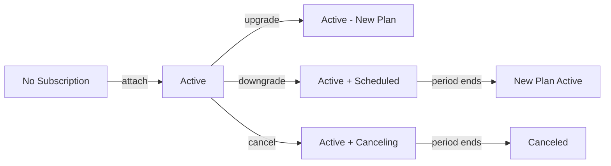

## Overview

Autumn provides a complete subscription management system that handles the entire lifecycle:

- **Attach**: Subscribe customers to products
- **Upgrade**: Move to higher-tier plans
- **Downgrade**: Move to lower-tier plans
- **Cancel**: End subscriptions
- **Scheduled Changes**: Plan changes at period end

<Tip>
Autumn automatically handles proration, billing cycles, and Stripe synchronization for you.
</Tip>

## Subscription Lifecycle



## Attaching Products (New Subscriptions)

<Steps>
  <Step title="Create a customer">
    First, ensure your customer exists in Autumn.

    ```typescript
    const customer = await autumn.customers.create({
      id: "customer_123",
      name: "John Doe",
      email: "john@example.com"
    });
    ```
  </Step>

  <Step title="Attach a product">
    Subscribe the customer to a product.

    ```typescript
    const response = await autumn.attach({
      customer_id: "customer_123",
      plan_id: "pro-monthly"
    });

    console.log(response);
    // {
    //   success: true,
    //   customer_product: {
    //     product_id: "pro-monthly",
    //     status: "active",
    //     current_period_start: "2026-02-18T00:00:00Z",
    //     current_period_end: "2026-03-18T00:00:00Z"
    //   }
    // }
    ```
  </Step>

  <Step title="Handle payment collection">
    If payment is required, Autumn can redirect to Stripe Checkout.

    ```typescript
    const response = await autumn.attach({
      customer_id: "customer_123",
      plan_id: "pro-monthly",
      redirect_mode: "if_required",
      success_url: "https://example.com/success"
    });

    if (response.checkout_url) {
      // Redirect user to payment page
      window.location.href = response.checkout_url;
    }
    ```
  </Step>
</Steps>

### Attach Options

| Parameter | Type | Description |
|-----------|------|-------------|
| `customer_id` | string | Customer identifier |
| `plan_id` | string | Product/plan to attach |
| `redirect_mode` | string | `"always"`, `"if_required"`, or `"never"` |
| `success_url` | string | Where to redirect after successful payment |
| `plan_schedule` | string | `"immediate"` or `"next_cycle"` |
| `discounts` | array | Coupon codes to apply |
| `invoice_mode` | object | Invoice vs checkout settings |

### Immediate vs Scheduled Attach

```typescript
// Start immediately (default)
await autumn.attach({
  customer_id: "customer_123",
  plan_id: "pro-monthly",
  plan_schedule: "immediate"
});
// Product is active now

// Schedule for next billing cycle
await autumn.attach({
  customer_id: "customer_123",
  plan_id: "enterprise-monthly",
  plan_schedule: "next_cycle"
});
// Product activates at next billing period
```

## Upgrading Subscriptions

Upgrades happen immediately with prorated charges:

```typescript
// Customer currently on Basic ($10/month)
// Upgrade to Pro ($30/month) mid-cycle

await autumn.attach({
  customer_id: "customer_123",
  plan_id: "pro-monthly"  // Higher-priced plan
});

// Autumn automatically:
// 1. Activates Pro plan immediately
// 2. Calculates prorated charge for remaining cycle
// 3. Issues invoice or charges via Stripe
// 4. Resets billing cycle to today
```

### Upgrade Behavior

<Tip>
**Immediate activation**: Upgrades are activated immediately to give customers instant access to new features.
</Tip>

**Proration calculation:**
```
Days remaining in cycle: 15
Days in cycle: 30
Pro plan cost: $30
Basic plan cost: $10

Prorated charge = (30 - 10) * (15/30) = $10
```

## Downgrading Subscriptions

Downgrades are scheduled for the end of the current billing period:

```typescript
// Customer currently on Pro ($30/month)
// Downgrade to Basic ($10/month)

await autumn.attach({
  customer_id: "customer_123",
  plan_id: "basic-monthly"  // Lower-priced plan
});

// Autumn automatically:
// 1. Keeps Pro active until period end
// 2. Schedules Basic to start next period
// 3. No immediate charge
// 4. Updates billing to $10 for next period
```

### Why Scheduled?

Downgrades are scheduled to:
- Let customers use what they paid for
- Prevent prorated refunds
- Reduce churn (customer might change mind)

### Checking Scheduled Changes

```typescript
const customer = await autumn.customers.get("customer_123");

for (const product of customer.products) {
  if (product.status === "active") {
    console.log(`Active: ${product.product_id}`);
  }
  if (product.status === "scheduled") {
    console.log(`Scheduled: ${product.product_id} starts ${product.starts_at}`);
  }
}
```

## Canceling Subscriptions

Cancellations can be immediate or scheduled:

### Scheduled Cancellation (Default)

```typescript
await autumn.subscriptions.cancel({
  customer_id: "customer_123",
  product_id: "pro-monthly"
});

// Product remains active until period end
const customer = await autumn.customers.get("customer_123");
console.log(customer.products[0].status);  // "canceling"
console.log(customer.products[0].cancel_at);  // End of period
```

### Immediate Cancellation

```typescript
await autumn.subscriptions.cancel({
  customer_id: "customer_123",
  product_id: "pro-monthly",
  cancel_immediately: true
});

// Product is canceled now
const customer = await autumn.customers.get("customer_123");
console.log(customer.products[0].status);  // "canceled"
```

### Cancel with Reason

```typescript
await autumn.subscriptions.cancel({
  customer_id: "customer_123",
  product_id: "pro-monthly",
  cancellation_reason: "customer_service",
  cancellation_details: {
    comment: "Customer was unhappy with feature X"
  }
});
```

## Reactivating Canceled Subscriptions

Before cancellation takes effect:

```typescript
// Customer has canceling subscription
const customer = await autumn.customers.get("customer_123");
const product = customer.products.find(p => p.status === "canceling");

if (product) {
  // Reactivate by attaching the same product
  await autumn.attach({
    customer_id: "customer_123",
    plan_id: product.product_id
  });
  // Cancellation is removed, subscription continues
}
```

## Modifying Subscriptions

### Changing Quantities

```typescript
// Update seat count or usage limits
await autumn.subscriptions.update({
  customer_id: "customer_123",
  product_id: "pro-monthly",
  items: [
    {
      feature_id: "team_members",
      quantity: 10  // Change from 5 to 10 seats
    }
  ]
});

// Prorated charge for additional seats
```

### Adding Features

```typescript
// Add additional feature to existing plan
await autumn.subscriptions.update({
  customer_id: "customer_123",
  product_id: "pro-monthly",
  items: [
    // Keep existing features
    { feature_id: "basic_features", quantity: 1 },
    // Add new feature
    { feature_id: "premium_support", quantity: 1 }
  ]
});
```

### Applying Discounts

```typescript
await autumn.attach({
  customer_id: "customer_123",
  plan_id: "pro-monthly",
  discounts: [
    {
      coupon: "SUMMER2026",  // Coupon code
      promotion_code: "promo_abc123"  // Or Stripe promotion code ID
    }
  ]
});
```

## Trial Periods

### Setting Up Trials

```typescript
// Define product with trial
const product = {
  id: "pro-monthly",
  name: "Pro Plan",
  trial_days: 14,
  items: [...]
};

// Customer gets 14-day trial automatically
await autumn.attach({
  customer_id: "customer_123",
  plan_id: "pro-monthly"
});
```

### Checking Trial Status

```typescript
const customer = await autumn.customers.get("customer_123");
const product = customer.products[0];

if (product.trial_end) {
  const trialEnds = new Date(product.trial_end);
  const daysRemaining = Math.ceil(
    (trialEnds.getTime() - Date.now()) / (1000 * 60 * 60 * 24)
  );
  
  console.log(`Trial ends in ${daysRemaining} days`);
}
```

## Add-ons and Multiple Products

### Attaching Add-ons

```typescript
// Attach base product
await autumn.attach({
  customer_id: "customer_123",
  plan_id: "pro-monthly"
});

// Attach add-on product
await autumn.attach({
  customer_id: "customer_123",
  plan_id: "extra-storage",  // Must be marked as add-on
  new_billing_subscription: false  // Use existing subscription
});
```

<Warning>
Add-on products must have `isAddOn: true` in their configuration, otherwise they will replace the existing product.
</Warning>

### Managing Multiple Products

```typescript
const customer = await autumn.customers.get("customer_123");

console.log("Active products:");
for (const product of customer.products) {
  if (product.status === "active") {
    console.log(`- ${product.product_id}: $${product.price}/month`);
  }
}

// Total monthly cost
const totalCost = customer.products
  .filter(p => p.status === "active")
  .reduce((sum, p) => sum + (p.price || 0), 0);
console.log(`Total: $${totalCost}/month`);
```

## Billing Cycles and Periods

### Understanding Billing Periods

```typescript
const customer = await autumn.customers.get("customer_123");
const product = customer.products[0];

console.log(`Current period: ${product.current_period_start} to ${product.current_period_end}`);
console.log(`Next charge: ${product.current_period_end}`);

// Calculate days remaining
const periodEnd = new Date(product.current_period_end);
const daysRemaining = Math.ceil(
  (periodEnd.getTime() - Date.now()) / (1000 * 60 * 60 * 24)
);
console.log(`Days remaining in cycle: ${daysRemaining}`);
```

### Aligning Billing Cycles

```typescript
// Use same billing cycle for all products
await autumn.attach({
  customer_id: "customer_123",
  plan_id: "add-on-product",
  new_billing_subscription: false,  // Inherit billing cycle
  billing_behavior: "prorate"       // Prorate to align
});
```

## Invoice Mode vs Checkout Mode

### Checkout Mode (Default)

```typescript
// Redirects to Stripe Checkout for payment
await autumn.attach({
  customer_id: "customer_123",
  plan_id: "pro-monthly",
  success_url: "https://example.com/success"
});
```

### Invoice Mode

```typescript
// Creates invoice without redirect (for existing payment method)
await autumn.attach({
  customer_id: "customer_123",
  plan_id: "pro-monthly",
  invoice_mode: {
    enabled: true,
    finalize_invoice: true  // Charge immediately
  }
});
```

## Best Practices

<Tip>
**Always verify the response**: Check for `checkout_url` to handle payment flows correctly.
</Tip>

<Warning>
**Don't force immediate downgrades**: Let customers keep access to what they paid for until the period ends.
</Warning>

### Error Handling

```typescript
try {
  const response = await autumn.attach({
    customer_id: customerId,
    plan_id: planId
  });

  if (response.checkout_url) {
    // Payment required
    return { redirect: response.checkout_url };
  }

  // Success, no payment needed
  return { success: true };
} catch (error) {
  if (error.code === "payment_required") {
    // Handle payment failure
    return { error: "Please add a payment method" };
  }
  throw error;
}
```

### Subscription State Management

```typescript
function getSubscriptionStatus(product) {
  if (product.status === "active" && !product.cancel_at) {
    return "Active";
  }
  if (product.status === "active" && product.cancel_at) {
    return `Canceling on ${new Date(product.cancel_at).toLocaleDateString()}`;
  }
  if (product.status === "scheduled") {
    return `Starts ${new Date(product.starts_at).toLocaleDateString()}`;
  }
  if (product.status === "canceled") {
    return "Canceled";
  }
  return product.status;
}
```

## Next Steps

<CardGroup cols={2}>
  <Card title="Usage-Based Billing" icon="chart-line" href="/guides/usage-based-billing">
    Add metered usage to subscriptions
  </Card>
  <Card title="Webhooks" icon="webhook" href="/guides/webhooks">
    React to subscription changes
  </Card>
  <Card title="Seat-Based Pricing" icon="users" href="/guides/seat-based-pricing">
    Per-seat subscription management
  </Card>
  <Card title="Stripe Integration" icon="stripe" href="/guides/stripe-integration">
    Configure Stripe for billing
  </Card>
</CardGroup>